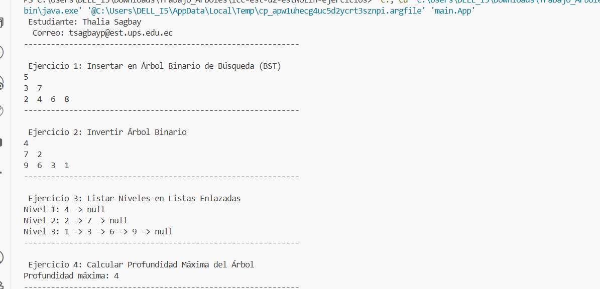

# Estructuras No Lineales – Ejercicios Árboles

Este proyecto contiene la solución a cuatro ejercicios prácticos sobre estructuras de datos tipo árbol binario, como parte del aprendizaje de estructuras no lineales en Java. Cada ejercicio se encuentra organizado en su propia carpeta, siguiendo la convención de paquetes y buenas prácticas.

---

## Identificación del Estudiante (Obligatorio)

Antes de comenzar a programar o ejecutar el proyecto, **debes completar tu nombre y correo institucional en el archivo `student.env`** que se encuentra en la raíz del proyecto. Este archivo es necesario para validar tu identidad como autor del trabajo.

### ¿Por qué es obligatorio?

Este proyecto utiliza una verificación automática que valida que has ingresado tu información personal. Si no lo haces:

- Al ejecutar el proyecto (`App.java`) verás este mensaje de error:
```
❌ Debes completar STUDENT_NAME y STUDENT_EMAIL en student.env
```
- No podrás enviar tu código (`push`) al repositorio si tienes activado el sistema de validación local.
- Las pruebas automáticas en GitHub Actions también fallarán si no detectan tu nombre y correo.

### ¿Qué debo hacer?

1. Abre el archivo `student.env` que ya está creado en el proyecto.
2. Rellena tus datos:

```
STUDENT_NAME=Tu Nombre Completo
STUDENT_EMAIL=tu.correo@institucion.edu.ec
```


3. **No borres estas líneas ni cambies los nombres de las variables.**
4. Guarda los cambios y vuelve a ejecutar el programa o hacer push.

> 💡 Este mecanismo asegura la autoría del código y que cada estudiante reciba su evaluación automática de forma personalizada.

---


## Explicación para el estudiante

```
src/
│
├── Materia/
│
├── Ejercicio_01_insert/
├── Ejercicio_02_invert/
├── Ejercicio_03_listLeves/
└── Ejercicio_04_depth/
```

---

## Descripción de Ejercicios

### Ejercicio 01: Insertar en un Árbol Binario de Búsqueda (BST)

Carpeta: `Ejercicio_01_insert`
Implementa un algoritmo para insertar nodos en un Árbol Binario de Búsqueda.

 **Input de ejemplo:** `[5, 3, 7, 2, 4, 6, 8]`
 **Output esperado:**

```
    5
  3   7
 2 4 6 8
```

---
### Explicacion: Ejercicio 1
- **Clase:** `InsertBSTTest`
- **Método:** `insert(Node root, int value)`
- **Descripción:** Inserta valores en un BST respetando la propiedad:
  - Valores menores van a la izquierda.
  - Valores mayores van a la derecha.
- **Impresión:** Se muestra el árbol por niveles usando `printPorNiveles()`.

### Ejercicio 02: Invertir un Árbol Binario

📂 Carpeta: `Ejercicio_02_invert`
Dada la raíz de un árbol binario, el algoritmo devuelve su versión invertida (espejo).

 **Input de ejemplo:**

```
    4
  2   7
1  3 6  9
```

**Output esperado:**

```
    4
  7   2
9  6 3  1
```

---

### Explicacion: Ejercicio 2
- **Clase:** `InvertBinaryTree`
- **Método:** `invertTree(Node root)`
- **Descripción:** Invierte el árbol binario intercambiando los hijos izquierdo y derecho en cada nodo.
- **Impresión:** Se muestra el árbol invertido por niveles.

### Ejercicio 03: Listar Niveles en Listas Enlazadas

📂 Carpeta: `Ejercicio_03_listLeves`
Devuelve una lista enlazada con los nodos por nivel. Si hay N niveles, se obtienen N listas.

 **Input de ejemplo:**

```
    4
  2   7
1  3 6  9
```

**Output esperado:**

```
4  
2 → 7  
1 → 3 → 6 → 9
```

---
### Explicacion: Ejercicio 3
**Clase:** `ListLevels`
- **Método:** `listLevels(Node root)`
- **Descripción:** Devuelve una lista de listas enlazadas, donde cada una representa los nodos en un nivel del árbol.
- **Ejemplo de salida:** 
Nivel 1: 4 ->
Nivel 2: 2 -> 7 ->
Nivel 3: 1 -> 3 -> 6 -> 9 ->


### Ejercicio 04: Calcular la Profundidad Máxima

Carpeta: `Ejercicio_04_depth`
Calcula la profundidad máxima de un árbol binario (la longitud del camino más largo desde la raíz hasta una hoja).

**Input de ejemplo:**

```
    4
  2   7
1  3  
8
```

**Output esperado:** `4`

---

### Explicacion: Ejercicio 4
**Clase:** `Depth`
- **Método:** `maxDepth(Node root)`
- **Descripción:** Calcula la máxima profundidad (altura) de un árbol binario.
- **Ejemplo de salida:** `Profundidad máxima: 4`

## Indicaciones Generales

* Lee cuidadosamente el enunciado de cada ejercicio.
* Cada carpeta debe contener:

  * Código fuente Java.
  * Casos de prueba.
  * Comentarios claros.
* Realiza commit y push con el mensaje:

  ```
  Estructuras No Lineales – Ejercicios Árboles
  ```
* En el AVAC, sube la **URL del repositorio** con el código.

---
### Captura de Ejecucion del Programa


## No se calificará si:

* No hay commit con los ejercicios.
* No se incluye este README explicativo.
* Las clases o métodos no siguen los nombres requeridos.

---

## Rúbrica de Calificación

| **Criterio**       | **Descripción**                                                                       | **Puntaje** |
| ------------------ | ------------------------------------------------------------------------------------- | ----------- |
| **Informe**        | No hay informe                                                                        | 0 pts       |
|                    | Informe parcial **sin explicación** de cada método                                    | 1 pt        |
|                    | Informe parcial **con explicación** de cada método                                    | 2 pts       |
|                    | Informe completo                                                                      | 3 pts       |
| **Funcionamiento** | No implementado                                                                       | 0 pts       |
|                    | Implementado parcialmente: <br>• Ejercicio 1 y 4 → 2 pts<br>• Ejercicio 2 y 3 → 4 pts | 2–4 pts     |
|                    | Código funcional pero **no pasa todas las pruebas**                                   | 6 pts       |
|                    | Código funcional y **pasa todas las pruebas correctamente**                           | 7 pts       |


## Contribuir

Para contribuir a este proyecto, por favor crea un fork y envía una solicitud de extracción, o simplemente abre un issue con tus comentarios y sugerencias.

## Autores

- [PABLO TORRES] - Desarrollo inicial

